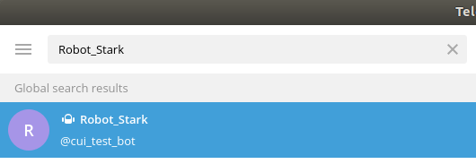

## Chat_Bot
本项目主要通过自然语言处理、语义理解、词向量、状态机等方法，以Python为编程语言，Telegram作为平台，利用IEXfinance API，搭建了一个能完成股票的股价信息、成交量信息、市值等查询的智能聊天机器人。
## 目录
* [安装](#安装)
* [实现](#实现)
## 安装
先安装基本的python包
>$ git clone https://github.com/dsfertgf/Chat_Bot 
>$ cd PyTorch-GAN/ 
>$ sudo pip3 install -r requirements.txt

再安装一些额外组件
>$ python3 -m spacy download en 
>$ python3 -m spacy download en_core_web_md

## 实现
### 运行示例
>$ cd PyTorch-GAN/ 
>$ python3 Chat_bot.py

打开telegram，搜索Robot_Stack就可以开始对话 

    

可以通过打字与Robot交流 

    

### DEMO-GIF
<b>You can find the demo-video</b> [here](https://www.bilibili.com/video/av67945882)

    

# 个性化改动
如果你对训练数据不满意，想要用更加丰富的训练数据得出更好地模型，你可以通过查看[Chatito 使用文档](https://github.com/rodrigopivi/Chatito)来下载chatito并对训练数据做个性化改动。

